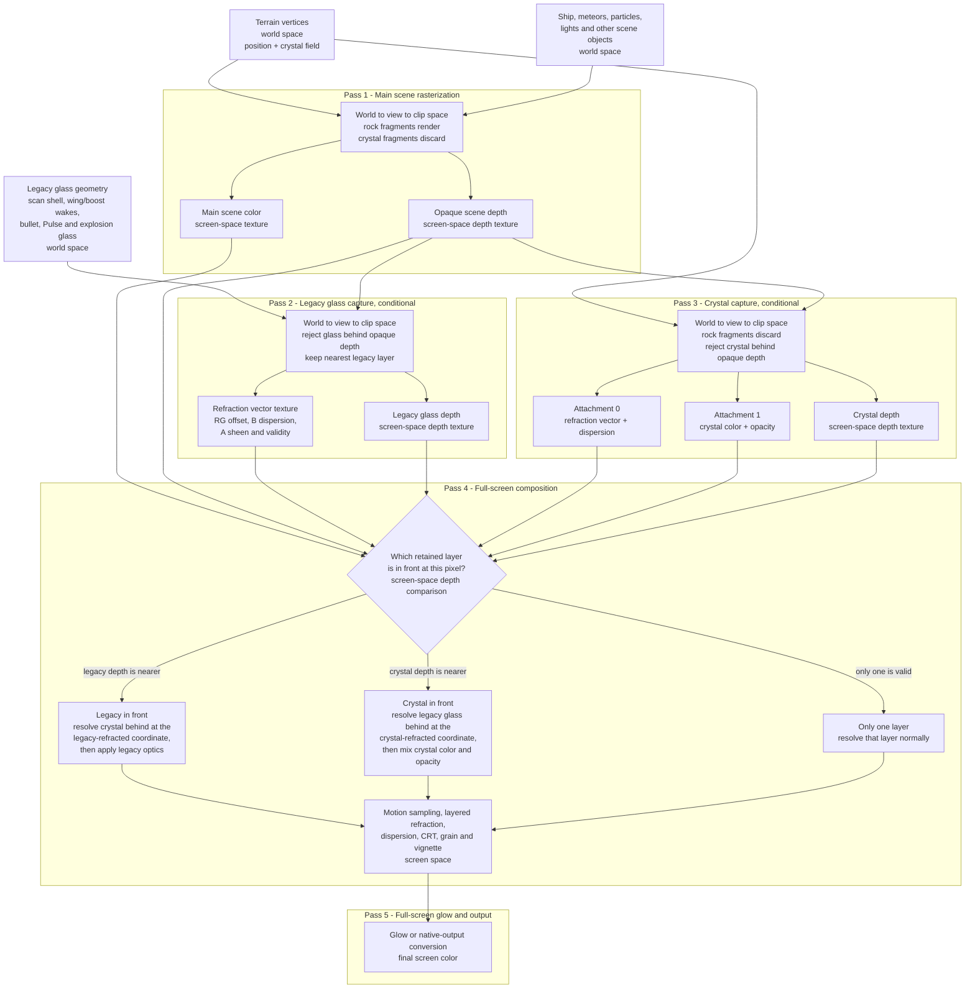

# Crystal terrain

Crystal is a material classification on the existing solid terrain surface. It
does not change density, collision, the guaranteed flight tunnel, or Pulse
carving. Density remains positive for solid and negative for air.

## Data path

- `ProceduralTerrain.crystalFieldAt` produces a deterministic, continuous 0–1
  field from a noise seed independent of terrain density.
- Workers sample that field into one `Uint8` value per density-lattice point.
- The polygonizer interpolates the material value at the same zero crossing as
  each position and emits one normalized byte per vertex.
- The density and crystal lattices are cached together. Pulse remeshing reuses
  both, while a ratio change is only a shader-uniform update.
- A threshold of `1 - terrainCrystalAmount` classifies the visible surface. The
  setting is an approximate visual ratio rather than an exact area measure.

## Render flow

Passes 2 and 3 are skipped independently when their material system is
inactive. Pass 4 is still one full-screen draw: the depth decision and both
possible layer orders are branches inside that shader, not separate passes.
The current design retains one nearest legacy-glass layer and one nearest
crystal layer per pixel; it does not attempt unlimited transparent layering.

There is no additional full-screen pass. Existing glass keeps its original
single-color refraction target. Crystal uses a separate target whose shader
explicitly writes its refraction and body-color attachments. The final
post-process compares both depth textures, resolves the rear layer first, and
then applies the front layer. A wake or scan shell therefore refracts crystal
behind it instead of deleting it, while front crystal retains its opacity over
legacy glass behind it. This separation is required because the legacy glass
shaders do not declare a second color output; putting them in the crystal
framebuffer would leave that output undefined on some GPUs. The post-process
also rejects displaced samples that would pull foreground scene geometry
through glass.

The rock and crystal shaders share the terrain cue calculations. Danger color,
probe front/pattern/trail, boost and Pulse lights, Pulse scars, fog, temporary
carve masks, and dot-mode coverage therefore remain aligned across the split.

## Controls and defaults

All controls are under **Terrain Rendering → Crystal**:

| Control | Range | Default |
| --- | ---: | ---: |
| Rock / Crystal | 0–1 | 0.10 (`~90 / 10`) |
| Crystal Opacity | 0–1 | 0.65 |
| Crystal Refraction | 0–3 | 1.10 |
| Crystal Dispersion | 0–1.2 | 0.18 |
| Crystal Color | color | `#8fefff` |

Old saved profiles inherit these shipped defaults because missing fields leave
the HTML defaults intact.

## Performance and limitations

Run `npm run profile:terrain-crystal` for the CPU guardrail. On the implementation
machine, uncached generation measured about 15% slower (16.80 ms to 19.24 ms per
profile iteration). Cached polygonization added about 0.05 ms. Each generated
vertex adds one byte, and each cached material lattice adds 1,331 bytes per chunk
at the current 10-segment resolution.

At 0% crystal, the refraction contributor is inactive and no crystal target is
cleared or drawn. At any nonzero amount, the cost is primarily drawing the
terrain geometry a second time. Crystal has two RGBA8 attachments and its own
depth texture; existing glass retains its RGBA8/depth target. Compared with the
combined-target prototype, this adds one screen-sized RGBA8 texture plus one
depth texture when both systems have been used. The existing final post-process
remains one draw. Layered glass adds conditional texture samples only where the
two retained systems overlap; it does not add another geometry or full-screen
pass.

This is screen-space glass, not volumetric ray tracing. It can refract only the
already-rendered scene. It retains the nearest legacy-glass surface and the
nearest crystal surface, then composites those two by depth. Transparent
objects that do not write useful depth retain the same limitations as the
existing glass system.
