# Aer0lith spaceship design research

**22 September 2026.** 20 external image references across five games, plus three renders of the initial ship concept. This is a historical design study: its 580-triangle concept was superseded by the current 22-triangle monochrome X-wing in [AircraftView.ts](../src/render/AircraftView.ts).

## Recommendation

The initial proposal was a compact twin-pod racer: a thick faceted hull, raised cockpit, separate engine housings, short stabilizers and restrained emissive exhaust. Shape and negative space carry the sci-fi identity. That first concept had 580 triangles, 15 meshes and three edge overlays, with no texture assets. The image below shows that concept, not the current game model.

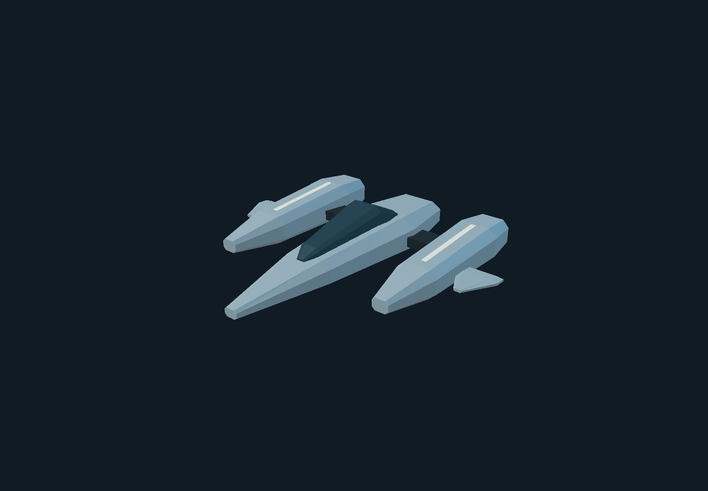

The observations below are visual analysis, not claims about each studio's internal design process. Official images are credited to their respective creators.

## WipEout - A racing machine with a human scale

These official concepts span several WipEout eras, rather than one uniform ship specification. They show a useful progression from recognizable cockpit and engine packaging to exaggerated racing proportions. The canopy establishes scale; deep engine housings and a continuous lower body make even a sharp nose feel manufactured. The blog includes artist commentary on cockpit interiors and race-grid staging. For Aer0lith, borrow the separation of cockpit, chassis and propulsion, with broad surfaces that remain legible without decals. These are visual observations, not claims about the original polygon budgets.

[Sony Interactive Entertainment / PlayStation Blog concept-art archive](https://blog.playstation.com/archive/2017/06/02/25-stunning-pieces-of-unseen-wipeout-concept-art-that-deserve-to-be-your-new-wallpaper/)

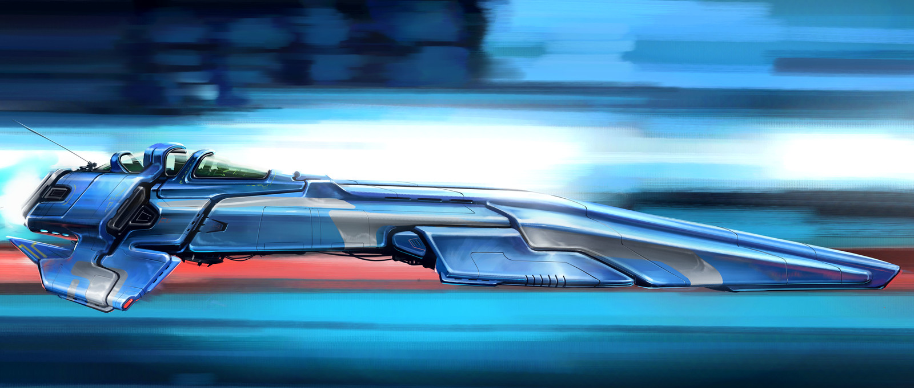

Side profile: a long nose sits ahead of a substantial rear body. The lower edge and engine mass prevent the silhouette from reading as folded paper.

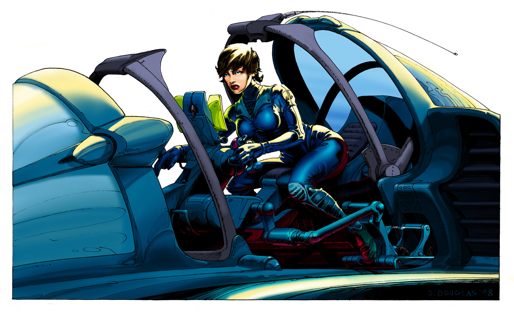

Cockpit cutaway: a seated pilot and canopy give the vehicle a believable scale. Aer0lith can suggest this with one dark, raised canopy.

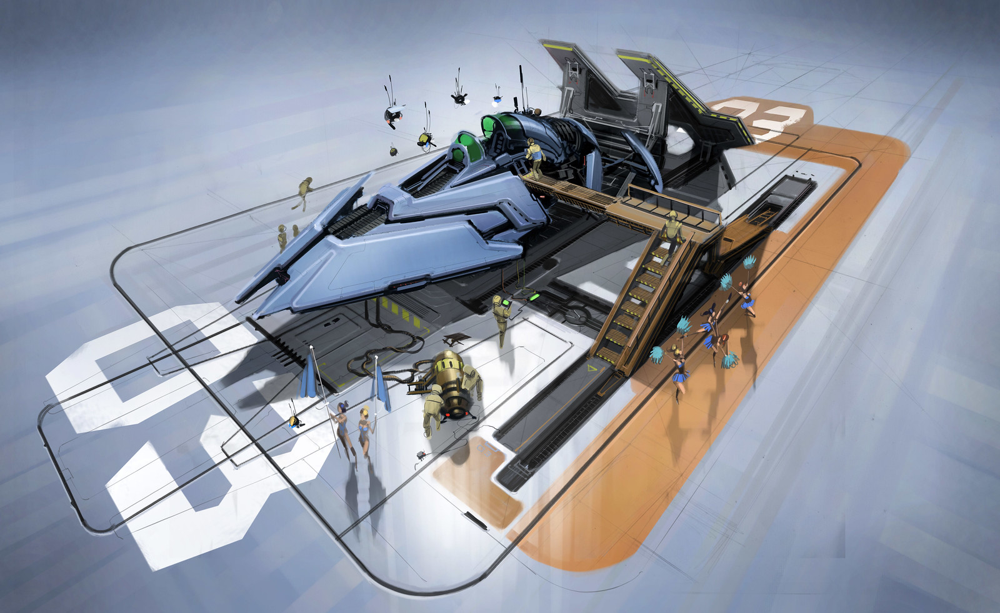

Grid staging concept: separate armor sections, machinery and the central cockpit give the craft depth from an elevated camera.

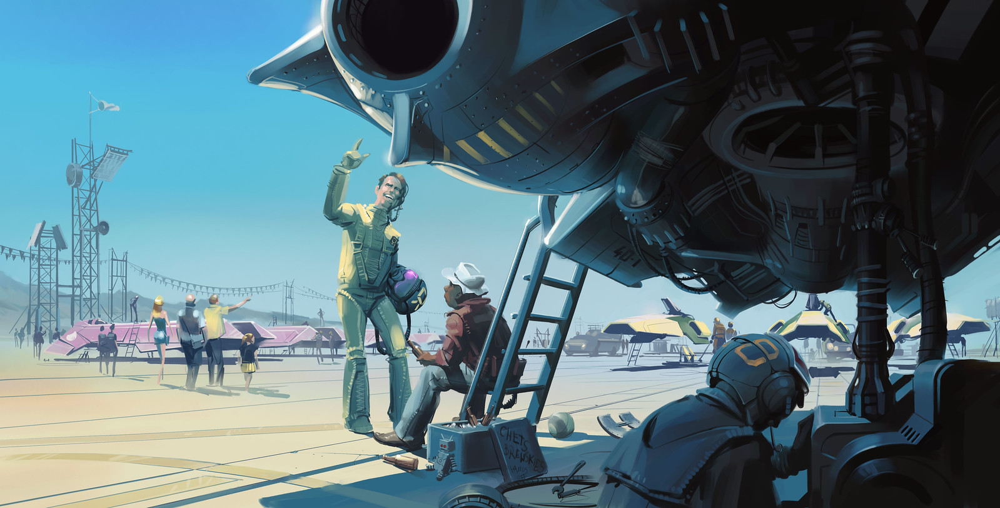

Ground-level engine view: the propulsion unit is a major volume, not merely a colored mark on a flat wing.

## BallisticNG - The closest low-poly reference

Neognosis describes BallisticNG as a tribute to older anti-gravity racers and provides ship and livery modding tools. The screenshots demonstrate how much identity can come from a few angular volumes. Longitudinal color blocks, a dark canopy and clearly separated front and rear forms remain visible while banking. It is the most directly useful reference here for a deliberately low-poly result. Aer0lith should retain those large shape changes and use actual geometry for its silhouette, while simplifying the dense text and team graphics.

[Neognosis / official Steam store screenshots](https://store.steampowered.com/app/473770/BallisticNG/)

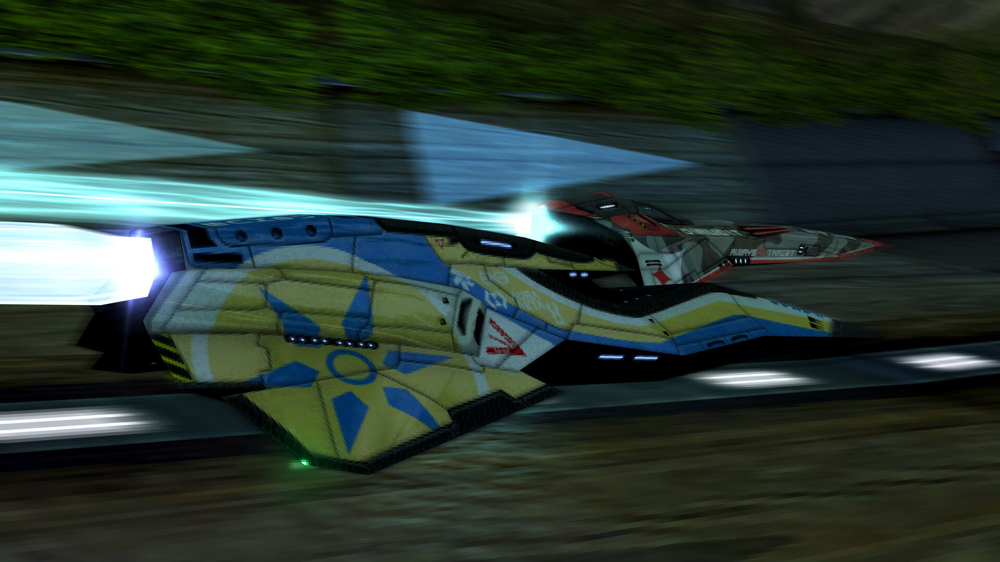

A top-oblique view exposes separate body masses and negative space. A broad livery block reinforces the geometry rather than replacing it.

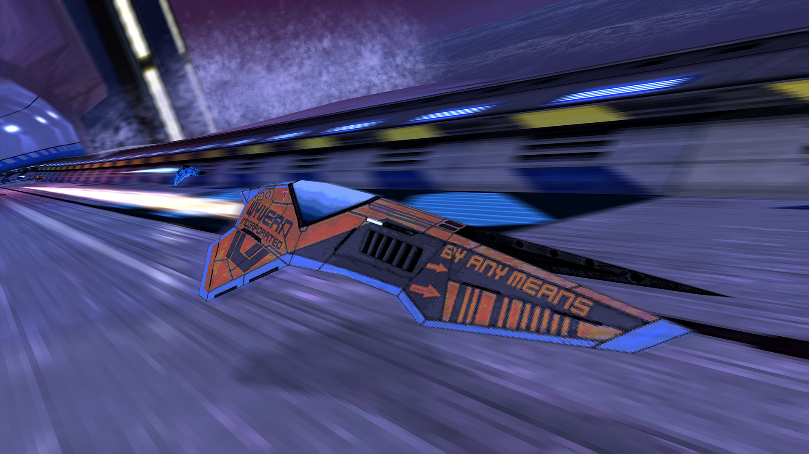

The angular canopy, long side surface and visible vent rhythm make the craft read as a machine even with coarse facets.

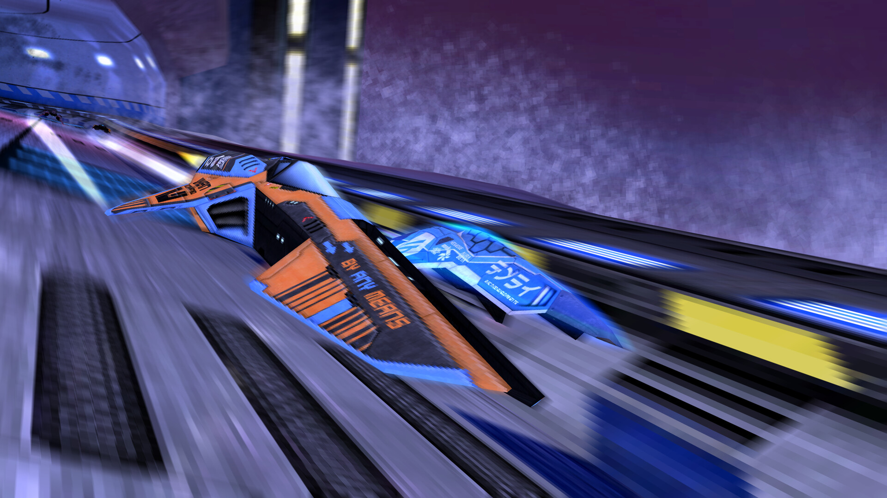

The same general design language remains readable at a steeper angle. Strong value separation does more work than tiny surface details.

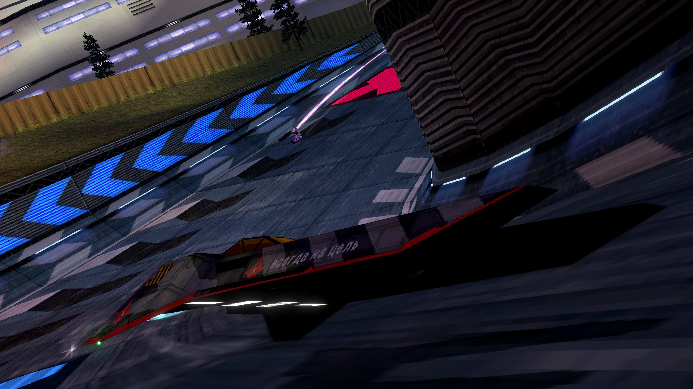

The low side silhouette has a continuous mechanical body. A narrow profile can still have thickness, an identifiable cockpit and a definite tail.

## Redout 2 - Propulsion defines the rear silhouette

The official site describes 12 chassis and customization across propulsion, stabilizers, rudders, wings and other parts. In these screenshots, separated propulsion elements and pronounced appendages give the craft a mechanical identity from the chase camera. Bright exhaust establishes a clear rear-facing signature. Aer0lith can borrow the two-engine rhythm and gaps between components, then reduce each component to a small number of planar faces. The reference is useful for packaging and rear-view readability; matching its surface complexity would work against the requested style.

[34BigThings / official Steam store screenshots](https://redout.games/redout2/)

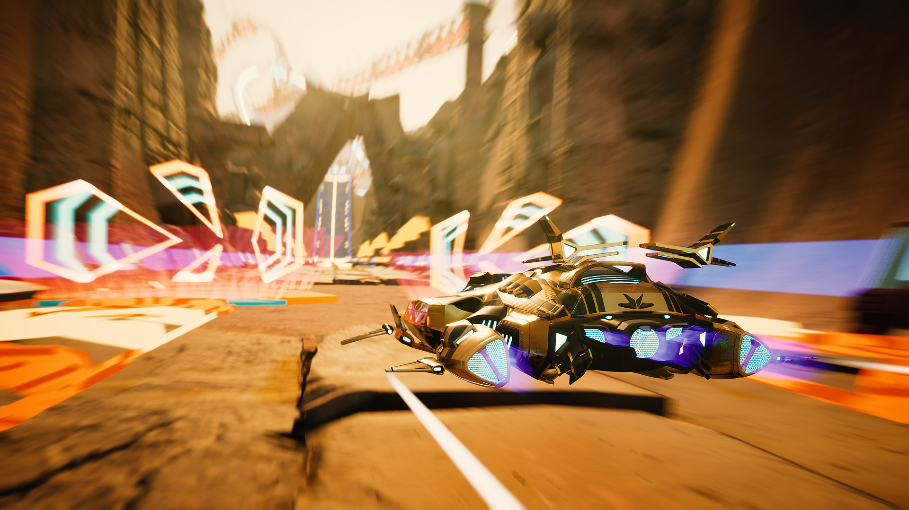

Low rear three-quarter view: multiple engine outlets sit inside substantial housings. Light is anchored to a physical component.

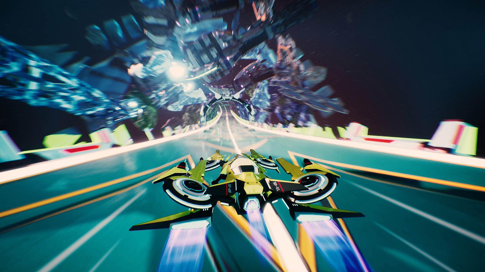

A more unusual rear arrangement shows how propulsion placement changes the whole silhouette. Distinct engine spacing is recognizable without a logo.

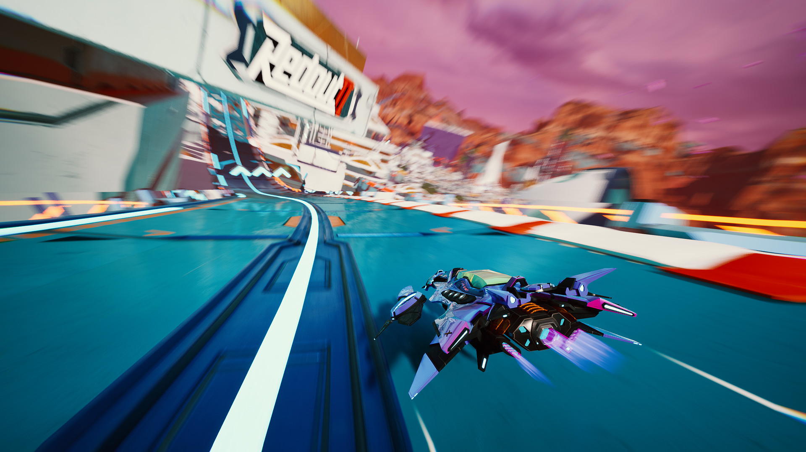

The chase view emphasizes the cockpit, lateral components and exhaust. These are the features Aer0lith needs to preserve at gameplay scale.

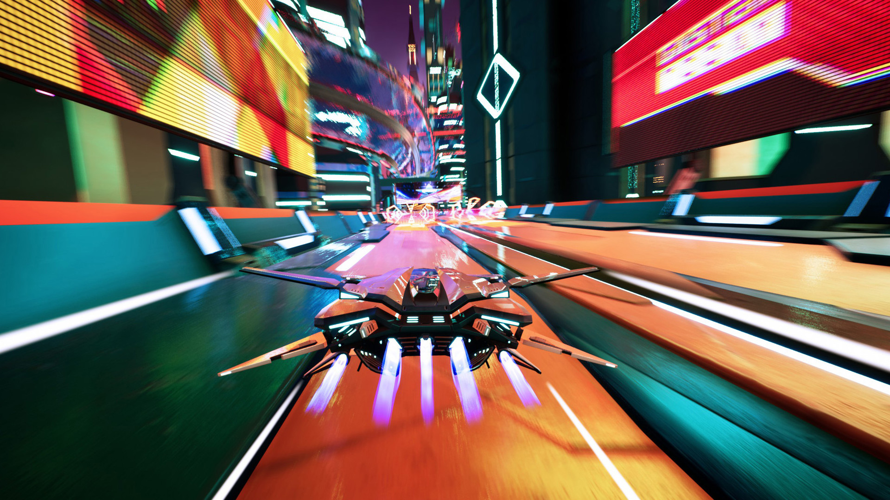

A wide rear stance and several bright outlets give immediate orientation. Use a restrained pair of outlets for Aer0lith rather than this density.

## PACER - Chunkier chassis, strong rear landmarks

The store screenshots show compact racing bodies with substantial rear surfaces and distinct cockpit placement. Their appeal comes partly from the relationship between a narrow forward section and a wider mechanical rear. In gameplay, that rear remains identifiable amid track markings, effects and other vehicles. Aer0lith benefits from this same hierarchy: broad engine shoulders, a central cockpit and small stabilizers. Keep the engine signature visible, but leave weapons and combat effects out of the model brief.

[R8 Games / official Steam store screenshots](https://store.steampowered.com/app/389670/Pacer/)

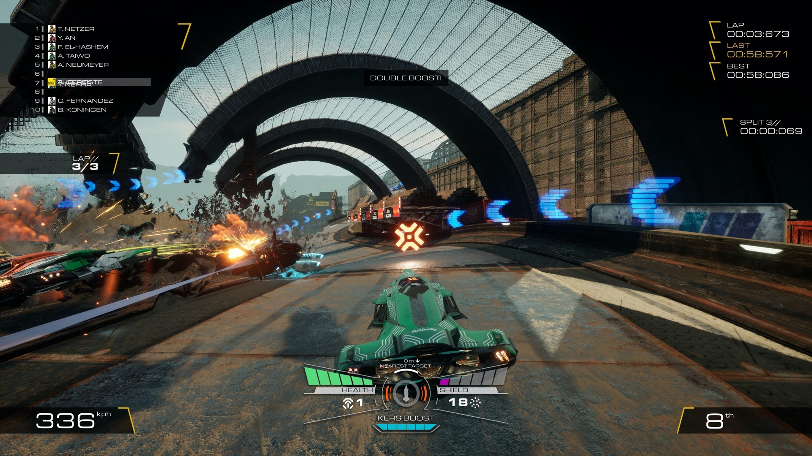

Direct chase view: the broad rear surface and separated outlets are the dominant landmarks. This is the most important angle for the default camera.

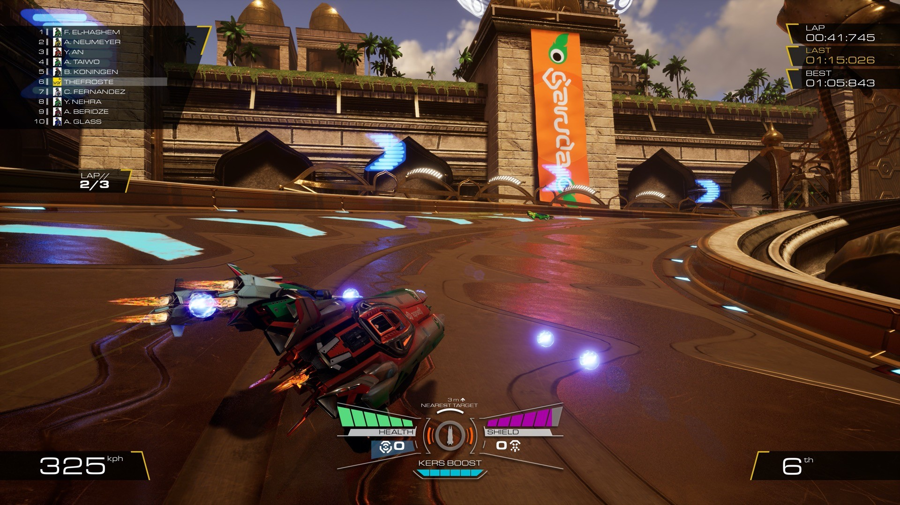

A banked craft reveals a body with depth below its upper panels. The visible sides help communicate roll.

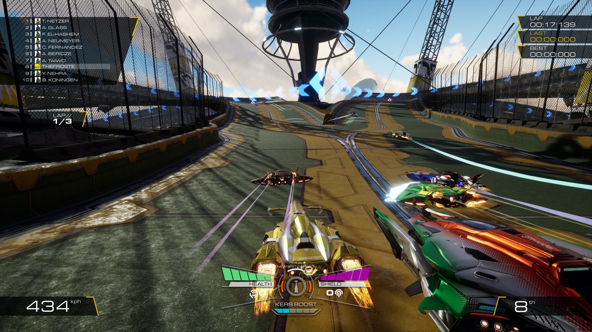

Several racers together demonstrate how width, nose shape and engine arrangement can distinguish vehicles before fine graphics become readable.

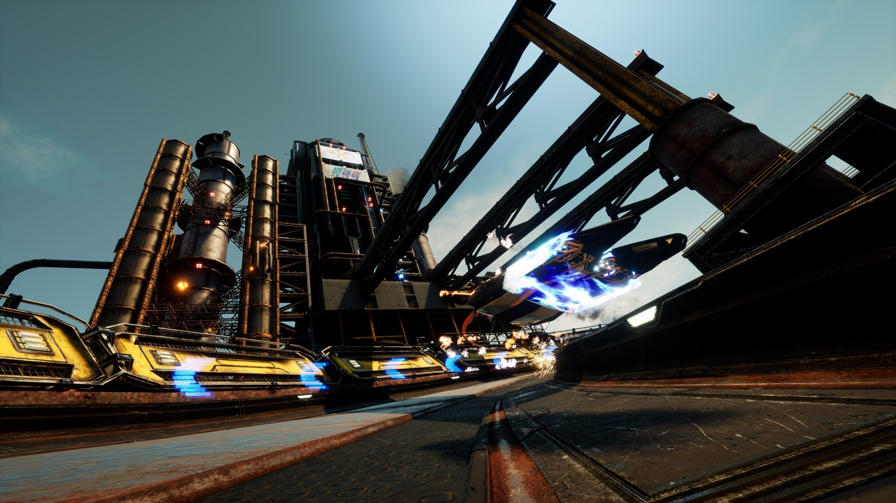

A lower trackside angle is a useful silhouette stress test: the craft should still look solid when the top surface is hidden.

## FAST RMX - Engine glow and clean shape families

The official page presents 15 racing machines and highlights boosting and phase switching. Its selection image is particularly useful because it shows a vehicle outside the visual noise of racing. Across the gameplay references, large luminous engine areas and simple body outlines remain prominent under motion blur. Aer0lith can borrow the bright exhaust framed by a darker housing, plus a restrained lengthwise accent. Avoid letting engine glow erase the surrounding geometry; the ship must still work with post-processing disabled.

[Shin'en Multimedia / official game-site images](https://fast.shinen.com/rmx/)

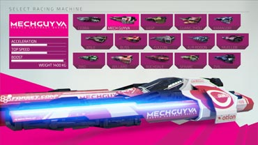

Vehicle-selection reference: the long chassis, elevated cockpit and broad engine housing form a readable shape before lighting effects are added.

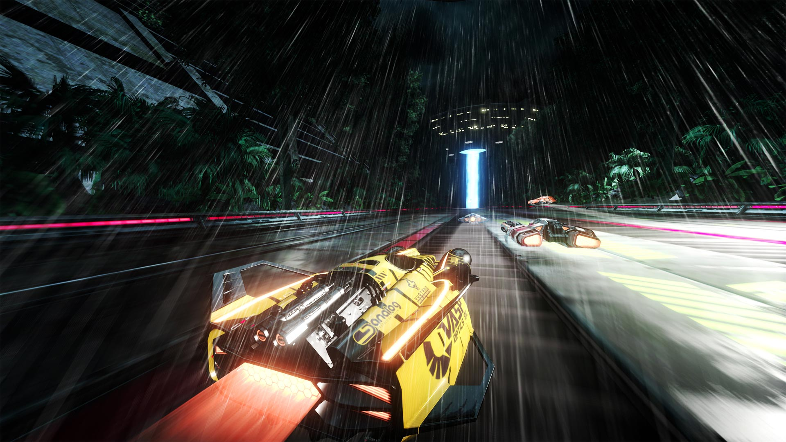

Rear chase screenshot: a large illuminated outlet is enclosed by a solid shell. The contrast makes forward direction immediately obvious.

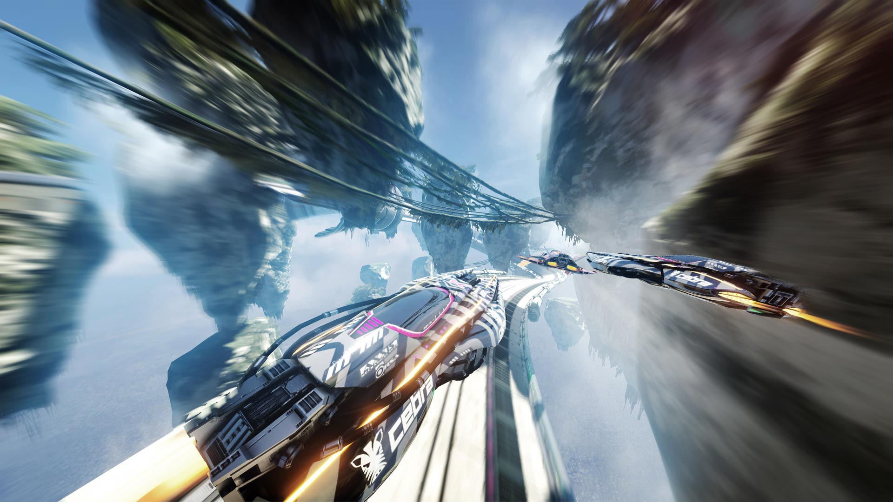

Banking screenshot: continuous side surfaces help the player read attitude even with substantial speed blur.

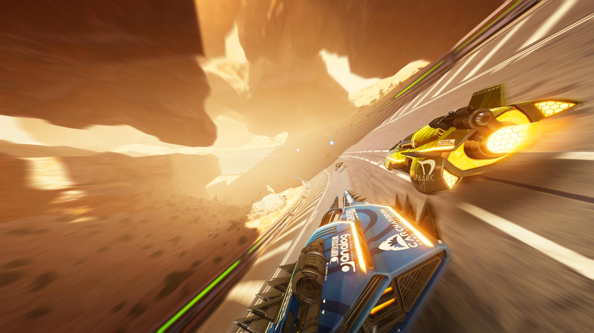

Two craft at different angles demonstrate why an exhaust landmark and a recognizable body outline need to work together.

## Implemented shape

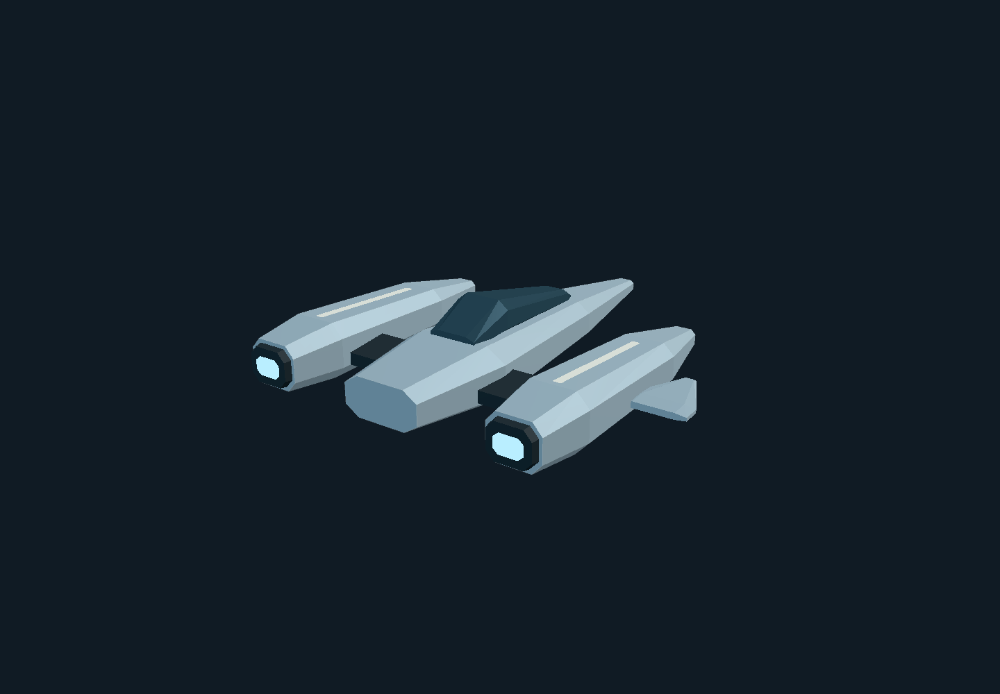

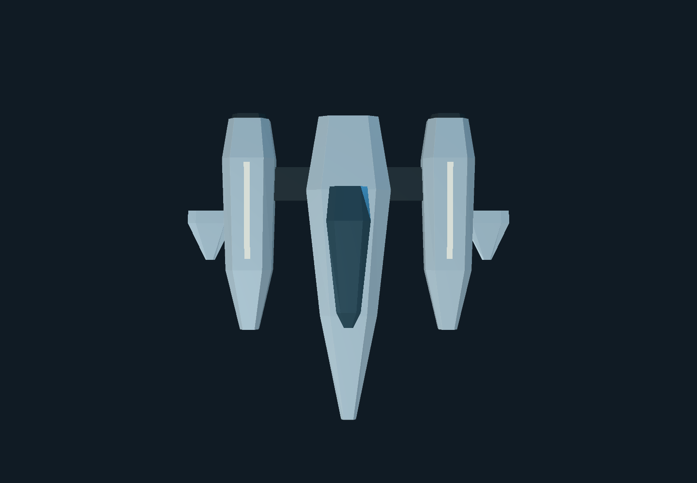

The pale body remains editable with Plane Color. The dark canopy and connectors and pale blue engine outlets preserve contrast. The width stays close to the existing trail and collision envelope.

## Image provenance

[Exact image URLs and credits](assets/spaceship-design/references.json). Downloaded 22 September 2026. External imagery is for design reference; the playable ship is original procedural geometry.
