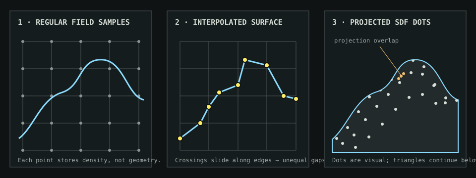

# Terrain sampling and dot rendering



The terrain begins as a regular three-dimensional lattice with one scalar density value every 12.8 meters. Those samples answer only whether a location tends toward open air or solid material. They are not the visible dots and they are not necessarily vertices in the final surface.

Marching tetrahedra examines each lattice cell and interpolates where the density crosses zero along its edges. A crossing can occur anywhere along an edge, so the extracted surface vertices and triangles are irregularly spaced even though the underlying field samples are regular.

The visible terrain dots are a separate shader treatment. Three regular two-dimensional SDF patterns are projected onto the surface along the X, Y, and Z axes, then blended according to surface orientation. Curved surfaces can stretch the projections, switch their dominant axis, or overlap them. This produces some apparent clusters and gaps. Continuous mesh triangles between the dots are expected because the dots visualize the surface; they do not mark its finest polygon resolution.

## Dot-density control

`DOT DENSITY` is expressed as projected dots per 100 square meters. This keeps the control intuitive—raising the value always shows more dots—while preserving world-space sizing and perspective. The shader derives its grid spacing as:

```text
spacing in meters = sqrt(100 / density)
```

For example, `4 / 100 M²` produces a 5-meter projected spacing. Density changes only the visual sampling pattern; it does not regenerate the volumetric field or alter collision geometry.

## Probe interaction

Dot and mesh modes share the same probe masks. In dot mode, the scan temporarily reveals and tints the mesh beneath the dots. In mesh mode, it reveals and tints the projected dots above the mesh. The expanding core, nearby influence, and persistent afterglow therefore use identical timing and blue-color logic in both modes.
