# Aer0lith UI and Interaction Design Research

**Prepared:** September 2026

**Scope:** drone control applications, racing and vehicle games, Spyglass, aviation/surveillance displays, and the supplied visual references
**Design target:** Aer0lith as an endless, non-combat, retro-futurist flight instrument

## Executive conclusion

Aer0lith should not become a dashboard covered in permanent gauges. Its strongest direction is an **adaptive sensor instrument**:

1. Keep the world and aircraft visually dominant.
2. Keep only orientation and immediate flight state near the center.
3. Place persistent numbers at predictable edges.
4. Render route, scan, target, and danger information in world space whenever the information describes something in the world.
5. Let information appear because of a state change—manual takeover, throttle, probe contact, proximity danger, camera orbit—not simply because there is room for it.
6. Preserve the current restrained palette: gray/white for neutral information, warm yellow for guidance, light blue for sensing, and red only for immediate danger or collision.

This combines the strongest logic from professional drone apps, vehicle games, and the supplied references without copying their clutter or combat semantics. Research on tactical displays supports this direction: dimming less important objects improved response time to relevant threats in one experienced-user study, while adaptive drone AR interfaces have been found to reduce cognitive load and improve situational awareness ([St John et al.](https://pubmed.ncbi.nlm.nih.gov/16435693/), [SafeSpect](https://arxiv.org/abs/2504.16533)).

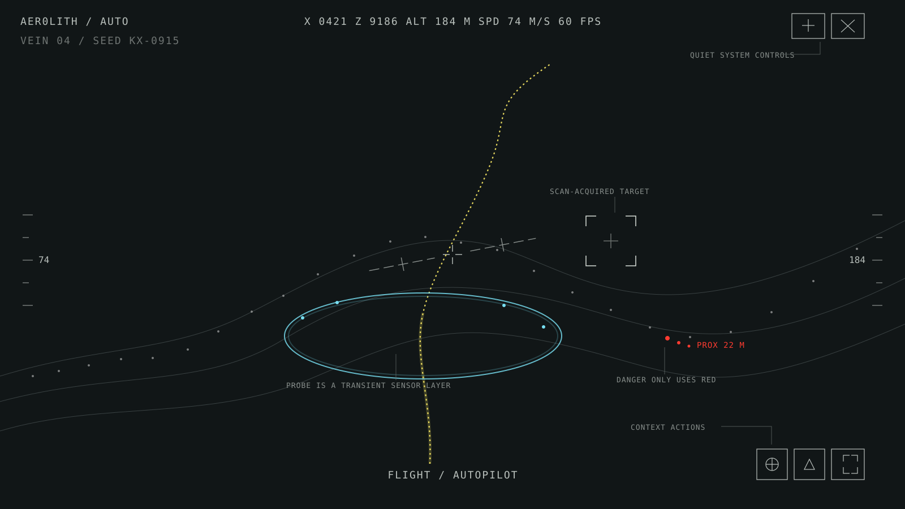

The diagram is a hierarchy proposal, not a request to add every depicted element permanently. The blue probe, target bracket, and red danger signal are transient layers.

---

## 1. Visual research plates

### 1.1 Professional drone applications


*DJI Fly camera view. The scene occupies almost the entire display; status is across the top, camera actions form a right-side rail, telemetry sits low, and map/attitude information is switchable. [DJI interface guide](https://repair.dji.com/help/content?customId=01700006562&lang=en&paperDocType=ARTICLE&re=US&spaceId=17).*

DJI Fly demonstrates five useful rules:

- **One primary surface:** the live image remains dominant.
- **Stable zones:** system state at top, imaging actions at right, flight telemetry at bottom.
- **Color is status:** normal vision-system state is white; unavailable state turns red.
- **Progressive disclosure:** tapping a status item reveals details rather than displaying them all continuously.
- **Guarded consequences:** auto takeoff, landing, and return-to-home require press-and-hold confirmation.

Skydio uses a similar camera-first structure but places more emphasis on autonomy: subject indicators, skill settings, return-to-home, telemetry, map, and optional picture-in-picture thermal video share one flight deck. Crucially, Skydio allows telemetry shown on the flight screen to be configured, recognizing that different missions need different information ([Skydio X2D operator manual](https://support.skydio.com/hc/article_attachments/14350896190235)).

QGroundControl separates **Fly**, **Plan**, **Vehicle Configuration**, and **Analyze** into top-level workspaces. During flight, its toolbar gives compact state; selecting an item reveals the reason behind a warning or more detailed settings. Its state model distinguishes ready, warning-ready, armed, flying, landing, lost communication, and other operational conditions instead of reducing everything to a single generic indicator ([QGroundControl overview](https://docs.qgroundcontrol.com/master/en/qgc-user-guide/getting_started/ui_overview.html), [Fly toolbar](https://docs.qgroundcontrol.com/master/en/qgc-user-guide/fly_view/fly_view_toolbar.html)).

**Lesson for Aer0lith:** the existing Ambient/Analysis switch is good, but Analysis should itself be progressively disclosed. A compact flight layer should remain readable while detailed diagnostics live behind Settings or appear only in response to a probe, warning, or direct request.

### 1.2 Spyglass

<table>
  <tr>
    <td></td>
    <td></td>
    <td></td>
  </tr>
</table>

*Spyglass combines camera, maps, compass, gyroscope, position, target tracking, rangefinding, and other instruments in a single sensor-aligned visual language. [Official product page](https://spyglass-nav.com/).*

Spyglass is valuable less for its ornamentation than for its **coordinate logic**:

- The bearing scale, target arrows, horizon, and rangefinder remain tied to physical orientation.
- A location target is represented differently when it is visible versus off-screen.
- The same data can sit over camera, map, or a plain background.
- Movement-dependent information such as speed and ETA appears when the user actually starts moving.
- A double tap opens a quick-switching menu; two-finger and directional swipes adjust orientation, filters, and HUD colors.
- It switches seamlessly between flat compass and 3D viewfinder behavior as device orientation changes.

The manual explicitly distinguishes the horizon/roll reference, the central wing or crosshair, azimuth/bearing, target direction, and GPS accuracy. It also lets users change data amount, precision, scale marks, and units rather than forcing one density on everyone ([Spyglass user guide](https://spyglassnav.com/wp-content/uploads/2021/02/spyglass-user-guide.en_.pdf)).

**Lesson for Aer0lith:** distinguish reference frames. The crosshair is aircraft/camera-relative; the zero-roll horizon is gravity-relative; the autopilot route and scan targets are world-relative; FPS and camera name are screen/system-relative. Each should move—or remain still—according to the frame it represents.

### 1.3 Realistic and arcade racing


*The original WipEout keeps the road center comparatively clean, pushes lap/position/time to corners, and uses compact bars for speed-related state. [Image source](https://www.classic-games.net/playstation/wipeout/).*

The racing spectrum provides two complementary models:

**Simulation-oriented interfaces** emphasize stable, comparable values. Gran Turismo groups position, laps, time, gaps, map, speed/RPM, fuel, tires, and a contextual multi-function display. A braking suggestion changes state just before a turn instead of remaining visually loud throughout the race ([Gran Turismo 7 race-screen manual](https://eu.gran-turismo.com/es/gt7/manual/race/02)). Microsoft Flight Simulator similarly offers assistance presets and lets users choose minimal/full/disabled flight overlays, while temporary AI assistance can hold the aircraft when the pilot opens an in-flight panel ([Microsoft Flight Simulator accessibility guide](https://www.flightsimulator.com/accessibility/)).

**Arcade interfaces** amplify sensation. The vehicle-feel model described in Criterion's GDC material treats winning, cornering, overtaking, drafting, camera behavior, and vehicle response as a coordinated experience rather than separate systems ([Vehicle Feel Masterclass](https://media.gdcvault.com/gdc2018/presentations/Harris_Matthew_VehicleFeelMasterclass.pdf)). WipEout uses strong graphic identity but still protects the path directly ahead.

Racing games commonly communicate speed through several synchronized channels:

- FOV expansion during acceleration.
- Camera lag or subtle positional inertia.
- Engine pitch and wind intensity.
- Near-field particles or streaks.
- Peripheral motion and close geometry.
- A speed value or throttle bar that confirms the physical change.

These should agree. A dramatic FOV change with static audio feels cosmetic; strong streaks at low speed undermine trust. Aer0lith already has the correct ingredients, but their curves should share one normalized **speed sensation signal** instead of being tuned independently.

### 1.4 Spacecraft and other vehicle games

Star Wars: Squadrons deliberately places radar, targets, health, ammunition, speed, and power management into physical cockpit instruments. Optional overlay equivalents remain available for accessibility. The designers also kept critical information inside a safe visual area and avoided moving the camera during impacts in VR—instead, the cockpit moves around the stable viewpoint. They used exterior “space dust” as a frame of reference when the environment lacked nearby geometry ([EA Motive design account](https://www.ea.com/ea-studios/motive/amp/news/the-making-of-vr-part-1)).

The game exposes `Standard`, `Instruments Only`, and `Custom` presentation modes, plus individual controls for outlines, off-screen indicators, text near the crosshair, in-world markers, cockpit shake, and other layers ([Squadrons settings](https://www.ea.com/able/resources/star-wars/star-wars-squadrons/pc/gameplay-settings)). This is a useful precedent for separating **information content** from **visual flavor**.

Elite Dangerous takes the opposite extreme: an information-dense cockpit that spatially groups navigation, target, radar, ship state, and alerts around the central forward window. Its strength is spatial memory—experienced players know where to look. Its weakness for Aer0lith would be excessive permanent instrumentation. The official guide's annotated cockpit diagram is useful as a taxonomy, not as a density target ([Elite Dangerous player guide](https://d1wv0x2frmpnh.cloudfront.net/elite/website/assets/English-PlayersGuide_v2.00-Horizons.pdf)).

**Lesson for Aer0lith:** Ambient mode is analogous to “Instruments Only,” but because Aer0lith lacks a modeled cockpit dashboard it should retain the gold route guide and world feedback. Analysis mode can be customizable by layer, while the default stays minimal.

---

## 2. Supplied-reference analysis

The supplied images mix real or fictional EO/IR sensor displays, surveillance analytics, targeting HUDs, FPV telemetry, and CRT-styled media. Their most useful contribution is a grammar of **measurement, acquisition, and imperfect transmission**. Aer0lith should borrow that grammar without implying weapons or surveillance of people.

### 2.1 Spatial acquisition and sensor hierarchy

<table>
  <tr>
    <td>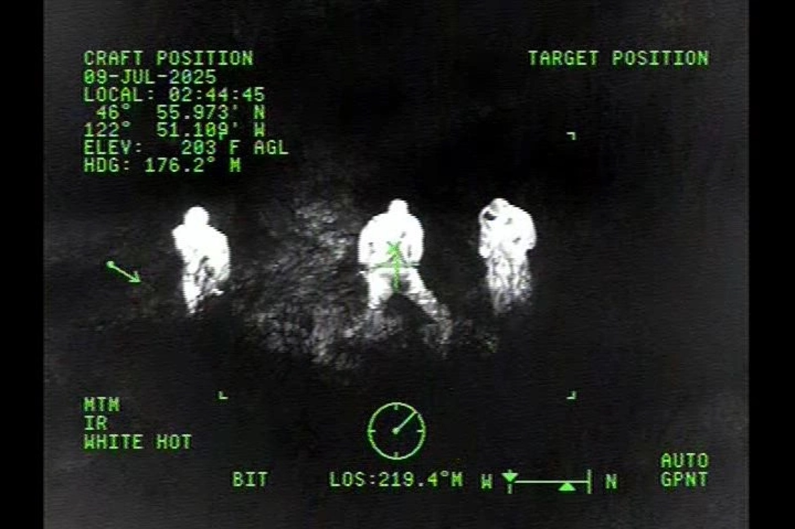</td>
    <td>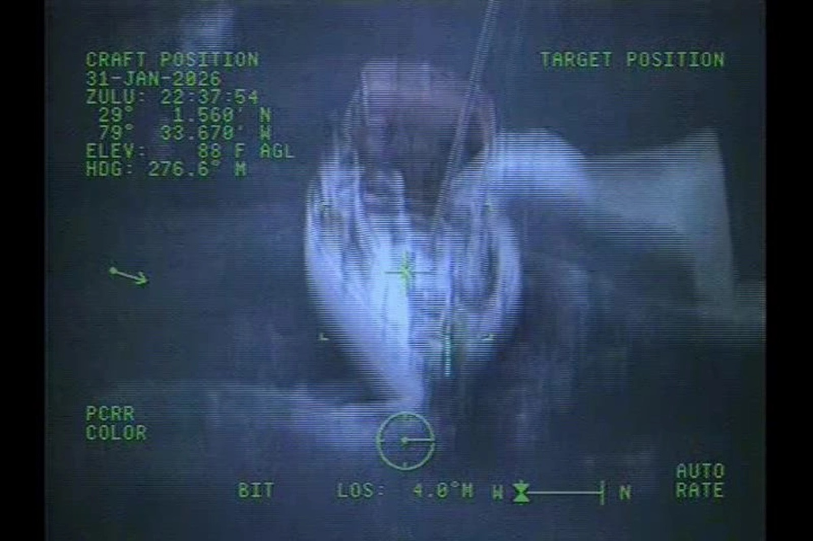</td>
  </tr>
  <tr>
    <td>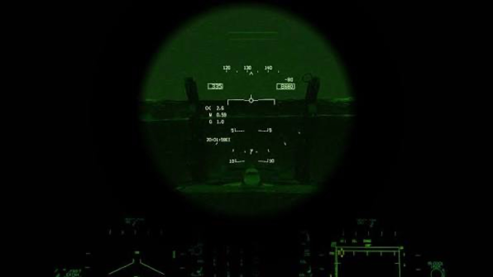</td>
    <td>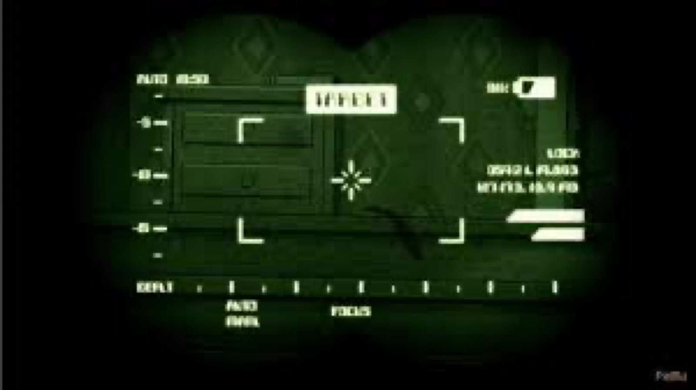</td>
  </tr>
</table>

The EO/IR-style screens create hierarchy through placement rather than panels:

- Own-vehicle data is top-left.
- Target data is top-right and may remain empty until acquisition.
- Sensor and polarity state stays low-left.
- Stabilization, line-of-sight, bearing, and mode stay along the bottom.
- The reticle remains small and center-weighted.

The circular night-vision apertures show how a sensor can temporarily constrain the field of view. This is useful for an optional **focused scan view**, but not as Aer0lith's normal presentation—the alien terrain is too important to mask continuously.

### 2.2 Detection, classification, and temporal memory

<table>
  <tr>
    <td>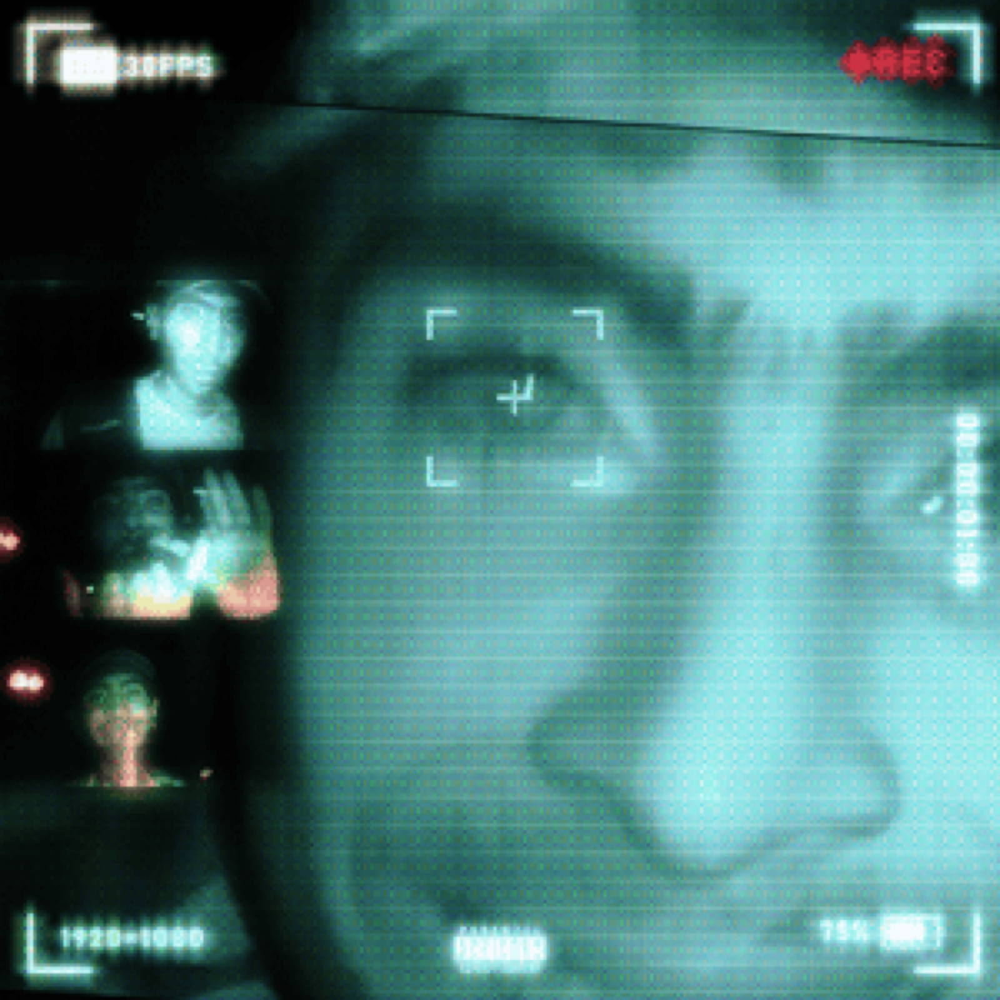</td>
    <td>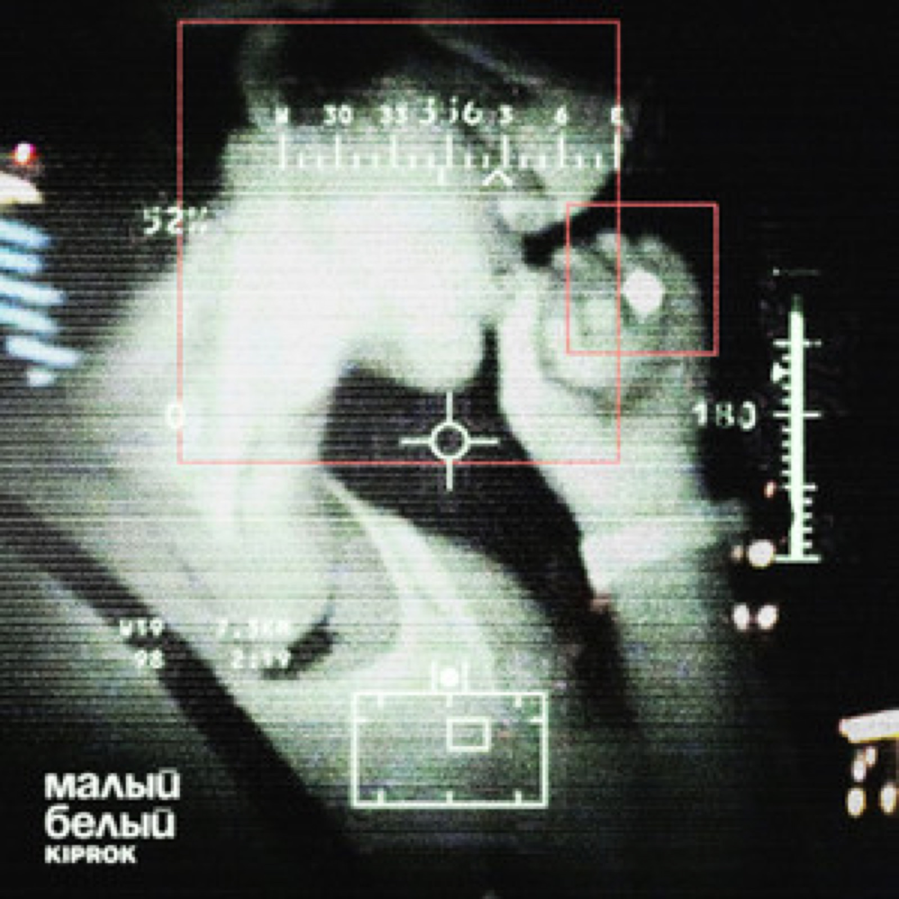</td>
  </tr>
  <tr>
    <td>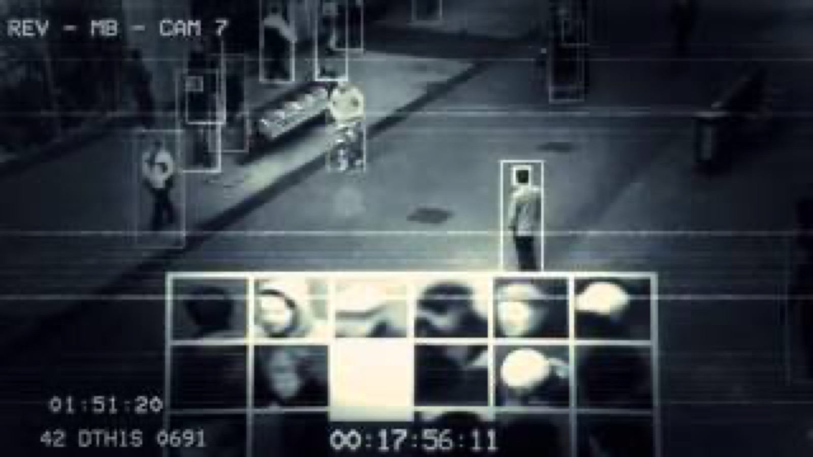</td>
    <td>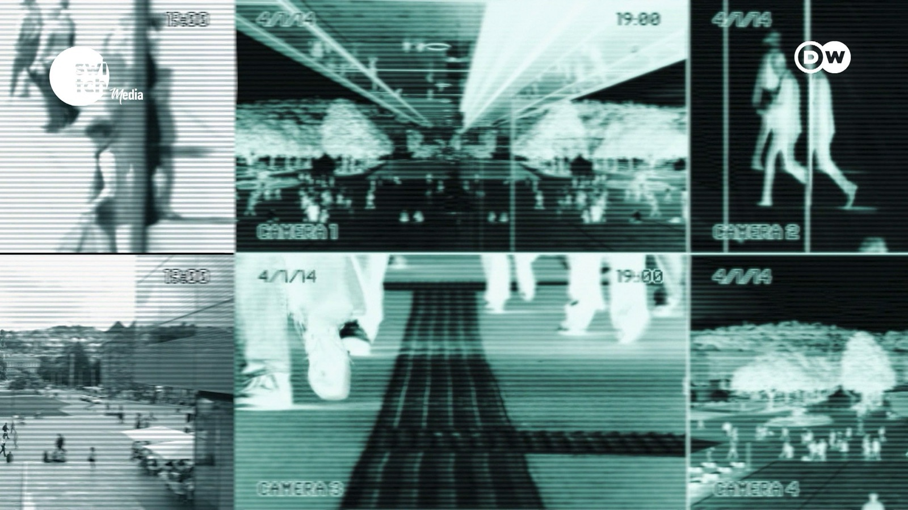</td>
  </tr>
</table>

These references reveal a useful state sequence:

1. **Candidate:** faint corners or a point marker.
2. **Detected:** complete corner bracket appears.
3. **Measured:** range/relative velocity becomes available.
4. **Tracked:** a leader line or short trail shows persistence.
5. **Lost:** the bracket fades while the last-known position briefly remains.

Aer0lith's scanned birds currently jump directly to a full target box. A staged sequence would make the probe feel like a working sensor. The thumbnail history in the surveillance reference suggests a later **flight recorder**, but live multi-camera mosaics should stay outside the main flight view because they fragment attention.

### 2.3 Center references and off-screen state

<table>
  <tr>
    <td>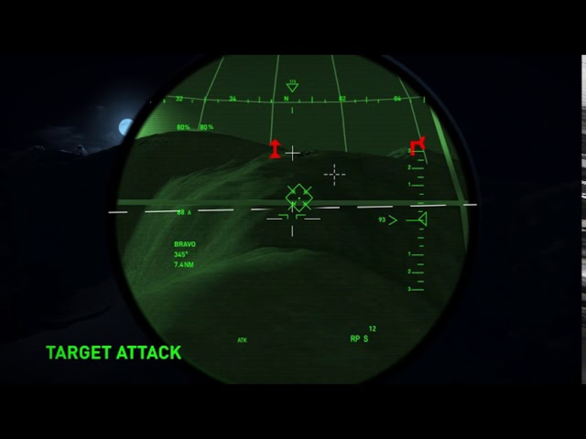</td>
    <td>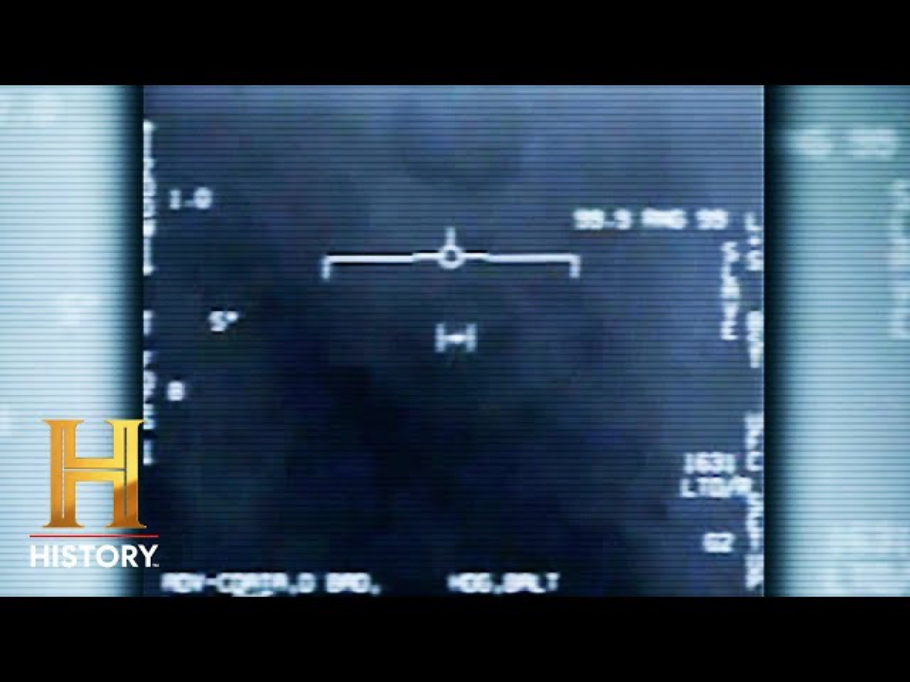</td>
  </tr>
</table>

The strongest center marks are small and do one job. Secondary target indicators sit away from the center or at the edge. This supports the current simple Aer0lith crosshair and split zero-roll line. It argues against putting speed, labels, or decorative brackets immediately around the crosshair.

For off-screen birds or danger, use a small edge chevron aligned to the projected direction. Do not clamp a full label to the edge: show only direction and urgency until the object re-enters view.

### 2.4 CRT texture and functional FPV telemetry

<table>
  <tr>
    <td>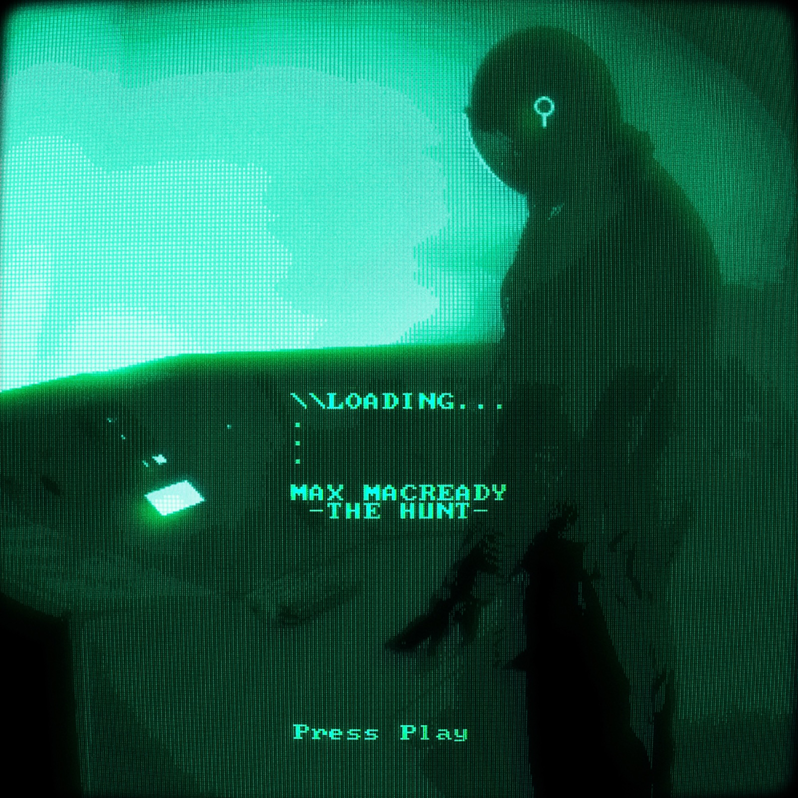</td>
    <td>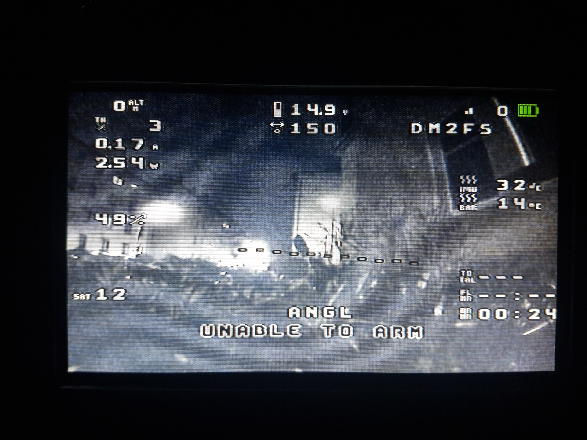</td>
  </tr>
</table>

The CRT reference is aesthetically compelling because the phosphor structure, bloom, curvature, and text belong to one display model. Aer0lith should preserve the recent decision to implement this entirely in the postprocess shader. A CSS texture on top of a separately curved shader breaks the illusion because the layers disagree spatially.

The FPV OSD is dense but functional: critical telemetry hugs the edges while the center keeps a horizon/reference line and flight view. It demonstrates why **location consistency** matters more than ornamental containers. Aer0lith should borrow the spatial stability but use far less data.

---

## 3. A unified model for Aer0lith

Every visual element should declare two properties: its **reference frame** and its **lifetime**.

| Element | Reference frame | Lifetime | Recommended treatment |
|---|---|---|---|
| Crosshair | Camera | Persistent in cockpit/analysis | Simple 1 px split cross |
| Zero-roll line | Gravity | Cockpit only | Counter-rotate against aircraft roll; preserve center gap |
| Autopilot guide | World | While autopilot is active; faint in Ambient | Warm yellow line; stable endpoint; fade before reaching aircraft |
| Wing trails | World | Distance-bounded history | Twin faint trails; throttle affects brightness/length |
| Wind streaks | World simulation, camera presentation | Speed-dependent | Shared speed-sensation curve; avoid streaks crossing UI |
| Probe wave | World | One scan cycle plus decay memory | Light-blue surface wave; temporarily reveals reciprocal render mode |
| Bird brackets | Bird transform/world | After probe acquisition | Pooled corner-only 3D target; staged acquire/track/lost behavior |
| Terrain danger | World/aircraft proximity | Only near collision envelope | Gray → red; no ground/wall distinction |
| Speed/altitude | Screen | Persistent in Analysis | Stable side positions, tabular numerals |
| Camera/FPS/seed | Screen/system | Analysis or debug | One quiet top row; no simulated warning color |
| Mode | Screen/control state | Persistent but subtle | Bottom center; temporary emphasis on state change |

This resolves many common “HUD feels wrong” problems. A world target should not drift with CSS layout. A roll reference should not roll with the aircraft. A screen-space FPS label should not glow when a 3D light passes beneath it.

---

## 4. Recommended information architecture

Keep the two user-facing presentation modes, but make Analysis adaptive.

### Ambient: `UI / OFF`

Visible:

- Terrain and aircraft.
- Gold autopilot route.
- Wing trails and speed/wind cues.
- Probe wave and scan-acquired bird brackets.
- Danger coloration and crash feedback.
- A faint but discoverable `UI / OFF` control for returning to Analysis.

Hidden:

- Coordinates, FPS, seed, speed, altitude, camera name, instructions, settings, and collision-debug mesh.

The point is not “no information.” It is **world-only information**.

### Analysis: `UI / ON`

Persistent:

- One-line top-center status: position/progress, absolute altitude, speed, FPS.
- Simple crosshair.
- Speed and altitude at vertical center edges.
- Bottom-center manual/autopilot state.
- Top-right camera/settings actions and bottom-right probe/throttle/fullscreen actions.

Transient:

- Input hints after first launch or inactivity.
- `FREE LOOK` and return timer only while orbit controls are displaced.
- Probe status while scanning.
- Bird measurements only after acquisition.
- Collision direction/urgency only near terrain.
- Camera-mode name for roughly one second after switching.

Detailed and debug-only:

- Seed controls, collision mesh toggle, rendering/postprocess controls, and flock tuning stay in Settings.
- A future `DEBUG` subsection can expose chunk/worker/render statistics without contaminating normal Analysis mode.

---

## 5. Layout recommendation

### Center: orientation, not telemetry

- Preserve the simple crosshair.
- In cockpit view, use the split zero-roll reference with a clear center gap.
- Add no permanent numbers within approximately 80 px of the crosshair.
- If manual roll becomes extreme, small outer tick marks can enter briefly; do not add a full attitude ladder by default.

### Top: system state

- Keep the top-center metrics on the same baseline as the first top-right button row on desktop and mobile.
- Use fixed-width numeric fields to prevent horizontal jitter.
- Highlight a value only because its meaning changed: manual takeover, critical proximity, stalled generation, or low frame rate—not because of decorative animation.
- Keep FPS neutral. If performance crosses a threshold, dim it or show a tiny `PERF` marker rather than flashing the number.

### Left/right center: one-dimensional quantities

- Speed left; absolute altitude right.
- One large value, a unit label, and only enough ticks to show direction/rate.
- Use a moving caret or short trail to show rising/falling trends instead of adding vertical-speed text.
- During Ambient mode, remove both entirely.

### Bottom center: control authority

- `AUTOPILOT` and `MANUAL` should be visually stable in one place.
- On takeover, crossfade text and emit the existing restrained beep.
- If autopilot is returning to its route, append a temporary substate: `AUTOPILOT / INTERCEPT`, then collapse to `AUTOPILOT` once settled.

### Bottom right: actions

- Keep scan and throttle as square controls immediately left of fullscreen.
- Use semantic motion: the scan icon expands concentrically; the throttle icon extends forward/upward.
- Separate press, hold, and toggle behavior. Throttle is hold; scan is tap; fullscreen is toggle.
- Show a one-time label after the first interaction, then rely on the icon.

### Touch joystick

- Keep it bottom-left, faint, and absent on non-touch devices.
- Give pitch and roll independent response curves and a generous center dead zone.
- Continue routing each pointer independently so camera orbit, joystick, camera switch, and scan can work simultaneously.
- When a finger leaves the valid control region unexpectedly, return smoothly to center rather than snapping flight input.

---

## 6. Proposed features and interactions

### Priority 0: clarity and trust

#### 6.1 Adaptive decluttering

Add a small visibility controller that computes each HUD layer from flight state rather than scattering show/hide conditions across components.

- Fade instructions after 5–8 seconds of competent input.
- Re-show the relevant shortcut after long inactivity, not the whole legend.
- During terrain danger, suppress nonessential notifications.
- While Settings is open, keep autopilot engaged and dim flight-only controls.

This applies the QGroundControl/DJI progressive-disclosure pattern and the research finding that intelligent lowlighting can improve attention to important peripheral threats.

#### 6.2 Directional proximity cue

The current red terrain response communicates *where the danger is in the world*. Add a very subtle screen-edge cue only when the closest collision sample is outside the camera view:

- Thin red arc/chevron at the corresponding edge.
- Opacity encodes time-to-contact, not raw distance alone.
- No text until time-to-contact is very short.
- Remove instantly when direction becomes visible; fade when risk recedes.

#### 6.3 Unified speed-sensation signal

Drive FOV, trail opacity, trail length, engine pitch, wind opacity, and wind length from one smoothed `speedSensation` value. Each system may remap that value, but all should share onset and release timing. This will make the aircraft feel faster without simply adding more particles.

#### 6.4 Camera orbit state

When the user first touches orbit controls, show `FREE LOOK` briefly. During the last second before automatic return, show a small shrinking arc—not a numerical countdown. Any new orbit input resets it. This removes the ambiguity between intentional snapback, rebase, collision recovery, and camera-mode switching.

### Priority 1: make sensing legible

#### 6.5 Probe acquisition sequence

When a wave reaches a bird:

1. A faint corner seed appears.
2. Four corners extend over 120–180 ms.
3. A short leader line reveals range and closing speed.
4. The bracket stays white while tracked.
5. After the probe memory expires, it contracts and fades rather than disappearing.

Keep the scan wave blue but mix it with the underlying terrain/mesh color at the leading edge. Do not turn acquired objects red; red remains collision danger.

#### 6.6 Sensor memory

Let scanned terrain and birds retain a decaying confidence value for 2–5 seconds after the wave passes. Express it through opacity and blue-to-neutral color return. This directly answers the visual logic in the supplied detection references: scanning is not just a flash; it produces temporary knowledge.

#### 6.7 Target information budget

For a scanned bird, show no more than:

- Short stable identifier such as `BIO 07`.
- Range.
- Relative closing/receding speed.

Show flock size once near the flock centroid, not on every bird. Avoid fictional coordinates, weapon language, health bars, or threat classes.

### Priority 2: customization without clutter

#### 6.8 HUD layer settings

Under a new `INTERFACE` settings subsection, expose:

- Essential telemetry: on/off.
- World labels: on/off.
- Off-screen cues: on/off.
- Camera return cue: on/off.
- HUD scale.
- HUD opacity.
- Units: metric/nautical.

Keep rendering appearance—CRT, glow, mesh/dot mode—separate from information content. Squadrons' `Standard`, `Instruments Only`, and `Custom` model is a good precedent.

#### 6.9 Quick visual presets

Add three presets above advanced controls:

- `CLEAN`: full resolution, no CRT, restrained glow.
- `INSTRUMENT`: subtle CRT, moderate glow, neutral grayscale.
- `SIGNAL`: stronger phosphor mask/grain and scan persistence.

Presets should set values but never lock them. Any adjustment becomes `CUSTOM`.

#### 6.10 Sensor palette mode

An optional temporary `VIS / THM` sensor presentation could reinterpret the terrain and birds through white-hot or black-hot shading. It should be a deliberate sensor mode entered through Settings or a future sensor button, not a permanent green tint. Preserve route and danger semantics above the palette.

### Priority 3: later experiential systems

#### 6.11 Flight recorder

Use the surveillance thumbnail-strip idea outside live flight:

- Keep a bounded ring buffer of recent interesting moments: probe detection, near miss, manual takeover, crash.
- Let the user open a pause-screen strip and replay 5–10-second clips or jump to a still.
- Do not render a live CCTV mosaic during flight.

#### 6.12 Route-confidence visualization

Encode autopilot confidence into the existing gold line:

- Stable route: thin continuous/dotted gold.
- High curvature or uncertain clearance: slightly wider spacing and lower opacity.
- Rejoining route: a second faint intercept arc merges into the stable route.

This should never make the path endpoint rebuild visibly each frame; geometry updates should advance at a lower fixed cadence and interpolate visually.

#### 6.13 Environmental readouts

Only add data that changes flight decisions. Good candidates are:

- Route curvature ahead.
- Vertical route trend.
- Current headwind/crosswind indicator if wind becomes physical.
- Closest-surface direction during danger.

Avoid battery, GNSS, radio, score, mission time, or artificial objective data unless those systems genuinely exist.

---

## 7. Visual language

### Color

| Meaning | Color | Rule |
|---|---|---|
| Neutral structure/data | gray-white | At least 85% of UI and world marks |
| Autopilot/guidance | warm yellow | Route, intercept, selected guidance state |
| Sensor/probe | light blue | Wave, newly observed geometry, scan acquisition |
| Immediate danger/fault | pure red/magenta-red | Terrain collision envelope, confirmed collision, fault only |

Do not reuse scan blue for ordinary buttons or use red for selection. A muted state should be lower opacity, not a new color.

### Typography

- Continue with Share Tech Mono as the default.
- Use tabular figures and fixed field widths.
- Use uppercase for short labels and sentence case for explanations/settings help.
- Establish only four sizes: micro label, telemetry, mode/status, warning.
- Avoid fake serial numbers or system acronyms that have no modeled meaning.

### Lines and brackets

- Screen UI: 1 CSS pixel at normal scale; preserve perceived thickness under responsive scaling.
- World lines: defined in world meters or camera-consistent line material, not arbitrary pixels mixed across systems.
- Target brackets: corner-only; size follows target bounds, not distance-independent screen boxes.
- Crosshair: thinner and visually quieter than target/danger state.

### CRT

- Keep phosphor mask, scanlines, curvature, grain, chromatic separation, and crash tearing in the postprocess shader.
- Apply the RGB mask in final output-pixel coordinates so it remains a display property.
- Make scanline/mask intensity independent from glow.
- When CRT and glow are disabled at full render scale, bypass postprocessing entirely.
- Never add a second CSS mask above the canvas.

---

## 8. Interaction-state logic

```text
                         flight input
       ┌──────────────┐ ───────────────▶ ┌────────────┐
       │  AUTOPILOT   │                  │   MANUAL   │
       └──────┬───────┘ ◀─────────────── └─────┬──────┘
              │              Space             │
              │                                │
              ├──── Probe ───▶ SCANNING ◀──────┤
              │                   │            │
              │             acquired targets   │
              │                   ▼            │
              │               TRACK MEMORY     │
              │                                │
              └──── collision ─▶ CRASH ────────┘
                                   │
                           safe checkpoint
                                   ▼
                               AUTOPILOT

Any flight state ── Pause/Settings ──▶ PAUSED OR AUTO-HOLD
Camera 2/3 ── orbit input ──▶ FREE LOOK ── idle timer ──▶ FOLLOW
```

Important interaction rules:

- A visual transition must reveal its cause. Camera return shows `FREE LOOK` state; checkpoint reset shows `CHECKPOINT`; collision shows the red mesh/contact state.
- Manual input takes control immediately. Settings interaction should not accidentally take manual control.
- A dangerous or destructive action uses hold-to-confirm; frequent reversible actions use a tap.
- Auto behaviors reset their idle timers when the user acts manually.
- State labels crossfade and remain spatially fixed to avoid visual jumping.

---

## 9. Responsive behavior

### Desktop landscape

- Full analysis layout.
- Hover/focus labels for icons.
- Orbit with pointer; keyboard flight remains primary.
- Settings panel may occupy the right edge, but should not cover the crosshair or bottom-center mode.

### Tablet landscape

- Same top-center telemetry baseline as desktop.
- Touch joystick appears bottom-left.
- Bottom-right actions remain reachable without crossing the screen.
- Side telemetry moves inward enough to avoid rounded display corners and safe areas.

### Phone portrait

- Do not vertically push top-center telemetry to avoid top-right buttons; overlap in x is preferable to changing its y position between orientations.
- Reduce gaps and typography through stepped breakpoints, not continuous linear scaling.
- Preserve bottom-center autopilot/manual state.
- Hide fullscreen in native Capacitor/touch presentation.
- Settings becomes a scrollable full-height sheet, but the aircraft remains on autopilot behind it.

### Multi-touch

Treat each pointer as belonging to a control owner:

- Joystick captures only its pointer ID.
- Orbit tracks one or two pointers that begin on the viewport.
- Buttons respond to their own pointer-down/up even while other pointers remain active.
- A button pointer must never be absorbed by the orbit recognizer.
- Disable browser double-tap zoom, selection, callouts, drag, and magnifier behavior only within the interactive app root—not globally outside the app.

---

## 10. What not to import from the references

- **Weapon semantics:** no `TARGET ATTACK`, lock tone, threat labels, or hostile red boxes. The experience is exploration, not combat.
- **Decorative telemetry:** do not fabricate latitude, battery, radio, or target classifications.
- **Permanent apertures:** circular night-vision masks waste the alien terrain view outside a deliberate sensor mode.
- **Constant glitch:** transmission noise is most effective as a state signal. Persistent strong artifacts reduce shape readability.
- **Multi-camera live mosaics:** useful for surveillance, poor for continuous piloting on a phone.
- **Color overload:** the green surveillance palette is evocative but would weaken Aer0lith's already coherent neutral/gold/blue/red semantics.
- **Screen-space target boxes:** world objects require world-space markers that follow transform, scale, depth, and occlusion.

---

## 11. Suggested implementation order

| Phase | Work | User value | Risk |
|---|---|---:|---:|
| 1 | Central HUD visibility controller and transient-state events | High | Low |
| 1 | Unified speed-sensation signal | High | Low |
| 1 | Free-look state/return cue | High | Low |
| 1 | Directional terrain danger cue | High | Medium |
| 2 | Probe acquisition + fading sensor memory | High | Medium |
| 2 | Target ID/range/closing speed and flock centroid label | Medium | Medium |
| 2 | Interface layer toggles and visual presets | Medium | Low |
| 3 | Route-confidence/intercept visualization | Medium | Medium |
| 3 | Optional thermal sensor mode | Medium | Medium |
| 4 | Bounded flight recorder/replay strip | Medium | High |

The first phase should improve legibility without materially increasing draw calls. The second phase should reuse the existing pooled target objects and probe state. The flight recorder should wait because it adds capture/storage/performance complexity that does not improve basic flight control.

---

## 12. Evaluation checklist

Test the interface by asking what the player can correctly answer within one second:

1. Who has control—manual or autopilot?
2. Which way is level in cockpit view?
3. Is the aircraft accelerating or returning to cruise?
4. Where is the intended path?
5. Did a probe detect something, and where is it?
6. Which direction contains the nearest collision danger?
7. Is the camera following or temporarily in free-look?
8. Why did the aircraft reset?

Run these checks at desktop landscape, tablet landscape, and phone portrait sizes, in both mesh and dot modes, with CRT/glow both on and off. Verify in grayscale as well: color should reinforce meaning, never be the only carrier of meaning.

## Sources

- [DJI Fly interface guide](https://repair.dji.com/help/content?customId=01700006562&lang=en&paperDocType=ARTICLE&re=US&spaceId=17)
- [Skydio X2D operator manual](https://support.skydio.com/hc/article_attachments/14350896190235)
- [QGroundControl UI overview](https://docs.qgroundcontrol.com/master/en/qgc-user-guide/getting_started/ui_overview.html)
- [QGroundControl Fly View toolbar](https://docs.qgroundcontrol.com/master/en/qgc-user-guide/fly_view/fly_view_toolbar.html)
- [Spyglass official site](https://spyglass-nav.com/)
- [Spyglass user guide](https://spyglassnav.com/wp-content/uploads/2021/02/spyglass-user-guide.en_.pdf)
- [Gran Turismo 7 race-screen manual](https://eu.gran-turismo.com/es/gt7/manual/race/02)
- [Criterion Vehicle Feel Masterclass](https://media.gdcvault.com/gdc2018/presentations/Harris_Matthew_VehicleFeelMasterclass.pdf)
- [Microsoft Flight Simulator accessibility and assistance design](https://www.flightsimulator.com/accessibility/)
- [EA Motive: Star Wars Squadrons VR and diegetic UI](https://www.ea.com/ea-studios/motive/amp/news/the-making-of-vr-part-1)
- [Star Wars Squadrons HUD settings](https://www.ea.com/able/resources/star-wars/star-wars-squadrons/pc/gameplay-settings)
- [Elite Dangerous player guide](https://d1wv0x2frmpnh.cloudfront.net/elite/website/assets/English-PlayersGuide_v2.00-Horizons.pdf)
- [Heuristic automation for decluttering tactical displays](https://pubmed.ncbi.nlm.nih.gov/16435693/)
- [SafeSpect adaptive drone AR HUD](https://arxiv.org/abs/2504.16533)
- [HUD composition and video-game user experience](https://www.sciencedirect.com/science/article/pii/S1071581915001779)
- [HUD design for peripheral vision](https://www.gamedeveloper.com/design/perceiving-without-looking-designing-huds-for-peripheral-vision)

The twelve local research images in this document were supplied by the user for visual analysis. Their original publication context is not assumed where it was not provided.
